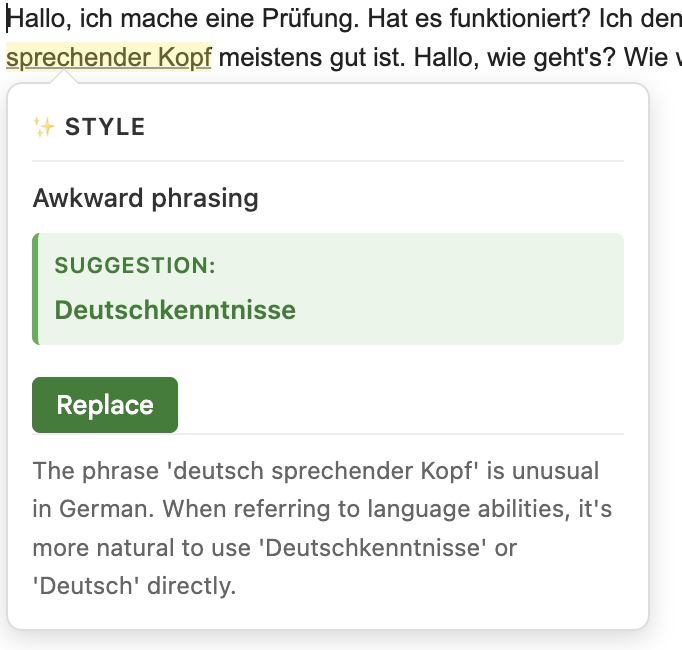
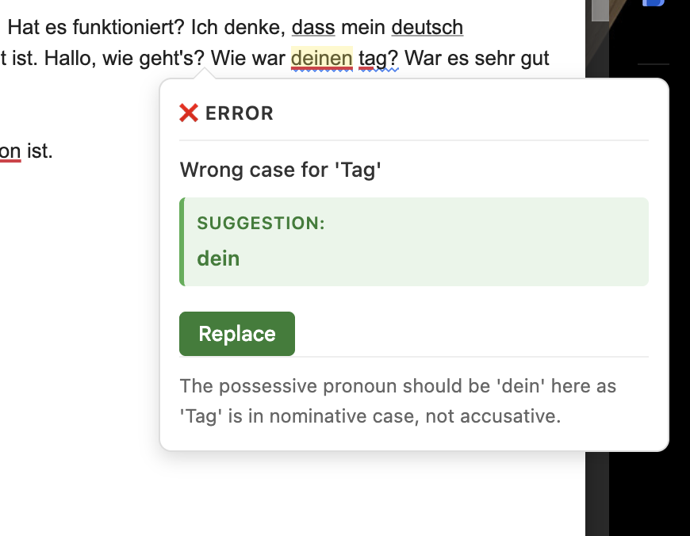

# Language Learning Assistant Chrome Extension

A Chrome extension that helps you improve your writing in a foreign language by providing real-time grammar, spelling, tone, and style suggestions powered by Claude AI.

## Features

- 🎯 **Real-time Analysis**: Automatically analyzes your text as you type
- 🌍 **20+ Languages**: Support for Spanish, French, German, Japanese, and many more
- 💡 **Smart Suggestions**: Grammar corrections, style improvements, and tone analysis
- 🎨 **Visual Feedback**: Color-coded underlines for different types of issues:
  - Red solid: Grammar/spelling errors
  - Blue solid: Style improvements
- 💬 **Detailed Tooltips**: Hover over underlined text to see explanations and corrections
- ✨ **One-Click Corrections**: Click "Replace" in the tooltip to instantly apply suggestions

## Screenshots

<table>
  <tr>
    <td width="50%">
      <h3>Style Suggestion</h3>
      
    </td>
    <td width="50%">
      <h3>Grammar Correction</h3>
      
    </td>
  </tr>
</table>

The extension provides inline feedback with detailed explanations and one-click corrections.

## Installation

### Prerequisites

1. Get an Anthropic API key from [console.anthropic.com](https://console.anthropic.com/)

### Load the Extension

1. Clone or download this repository
2. Open Chrome and go to `chrome://extensions/`
3. Enable "Developer mode" (toggle in top-right corner)
4. Click "Load unpacked"
5. Select the `lang-helper` directory
6. The extension icon should appear in your toolbar

### Setup

1. Click the extension icon in your Chrome toolbar
2. Select your target language from the dropdown
3. Enter your Anthropic API key
4. Toggle "Enable Assistant" on
5. Click "Save Settings"

### Add Icons (Optional)

For a complete experience, add icon images:
1. Create three PNG images: `icon16.png`, `icon48.png`, `icon128.png`
2. Place them in the `icons/` directory
3. Reload the extension in Chrome

## Usage

1. Navigate to any website with text input fields (Gmail, Twitter, Google Docs, etc.)
2. Start typing in your target language
3. The extension will automatically analyze your text when you focus on a text field or after you pause typing (1.5 seconds)
4. Hover over underlined text to see suggestions, explanations, and corrections
5. Click the "Replace" button in the tooltip to instantly apply the suggested correction

### Supported Text Fields

- Text inputs (`<input type="text">`)
- Textareas (`<textarea>`)
- Content-editable divs (like those in Gmail compose windows and rich text editors)

### Features in Action

- **Automatic Analysis**: Text is analyzed when you click into a field or 1.5 seconds after you stop typing
- **Smart Clipping**: Underlines are hidden when scrolled out of view or obscured by toolbars
- **Intelligent Positioning**: Tooltips automatically position themselves to stay visible
- **Progressive Corrections**: Apply corrections one at a time while keeping other suggestions visible
- **Automatic Cleanup**: Overlays are removed when you close or minimize windows

## How It Works

1. **Content Script** (`content.js`): Monitors all text input fields on web pages using MutationObserver
2. **Background Worker** (`background.js`): Sends text to Claude API for analysis with position verification
3. **Analysis**: Claude evaluates grammar, spelling, tone, and style with character-precise positioning
4. **Overlay System**: Creates positioned overlays with underlines that match the text exactly
5. **Smart Rendering**:
   - Hides marks that overlap with toolbars (e.g., Gmail compose toolbar)
   - Clips underlines when content scrolls out of view
   - Automatically removes overlays when elements are removed from DOM
6. **Interactive Tooltips**: Hover to see explanations and click "Replace" to apply corrections
7. **Position Adjustment**: After corrections, remaining suggestions are repositioned automatically

## Privacy

- Your text is sent to Anthropic's API for analysis
- API key is stored locally in Chrome's sync storage
- No data is collected or stored by this extension
- See [Anthropic's Privacy Policy](https://www.anthropic.com/privacy)

## Cost

This extension uses the Anthropic API which is a paid service:
- Claude 3.5 Sonnet: ~$3 per million input tokens
- Most analyses use 100-500 tokens
- Approximate cost: $0.0003-0.0015 per analysis

## Customization

### Change the LLM Model

Edit `background.js` line 4:
```javascript
const MODEL = 'claude-3-5-sonnet-20241022'; // Change this
```

### Adjust Analysis Delay

Edit `content.js` line 47:
```javascript
}, 1500); // Change delay in milliseconds
```

### Add More Languages

Edit `popup.html` and add options to the language select dropdown.

## Troubleshooting

### Extension not working

- Check that you've entered a valid API key
- Make sure "Enable Assistant" is toggled on
- Check the browser console for errors (F12 → Console)
- Verify your API key has credits at console.anthropic.com

### No highlights appearing

- Wait 1.5 seconds after typing before expecting analysis
- Ensure you're typing at least 10 characters
- Check that the text field is supported (input, textarea, or contenteditable)

### Highlights not visible

- Check for CSS conflicts with the website's styles
- Try refreshing the page after loading the extension

## Development

### Project Structure

```
lang-helper/
├── manifest.json          # Extension configuration
├── background.js          # Service worker for API calls
├── content.js            # Content script for text monitoring
├── content.css           # Styles for highlights and tooltips
├── popup.html            # Settings popup UI
├── popup.js              # Settings popup logic
├── icons/                # Extension icons
└── README.md             # This file
```

### Testing

1. Make changes to the code
2. Go to `chrome://extensions/`
3. Click the refresh icon on the extension card
4. Test on a webpage with text inputs

## Future Improvements

- [ ] Support for more LLM providers (OpenAI, Google, etc.)
- [ ] Offline grammar checking for basic errors
- [ ] Custom vocabulary/phrase lists
- [ ] Learning progress tracking
- [ ] Export corrections for study review
- [ ] Adjustable strictness levels
- [ ] Support for language-specific keyboard shortcuts

## License

MIT License - Feel free to modify and distribute

## Contributing

Contributions welcome! Please feel free to submit a Pull Request.

## Support

For issues or questions, please open an issue on the GitHub repository.
